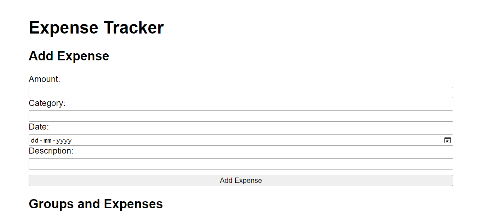
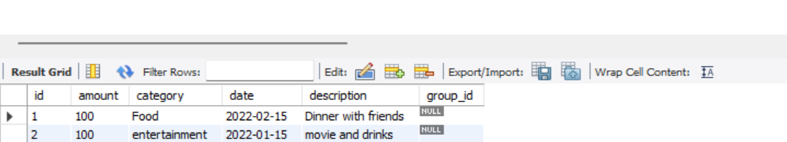

# ExpensesTracker
SpringBoot backend, MySQL for databases and HTML,CSS and JavaScript for frontend

#How to run
1.Clone the Repository
2.Build the Project: ./mvnw clean install
3.Run the Application: ./mvnw spring-boot:run

#database

